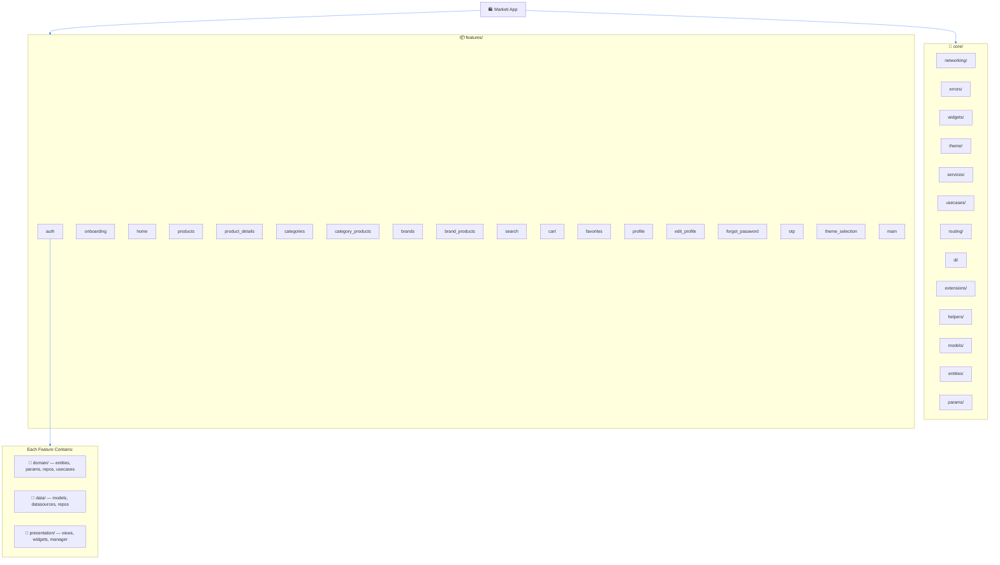

<p align="center">
  
</p>

<h1 align="center">🛍️ Marketi — Your Smart Shopping Companion</h1>

<p align="center">
  <a href="https://flutter.dev"></a>
  <a href="https://dart.dev"></a>
  <a href="#"></a>
  <a href="#"></a>
  <a href="https://github.com/Eslam-Hossam1/marketi/blob/main/LICENSE"></a>
</p>

<p align="center">
  <b>A beautifully crafted e-commerce mobile app built with Flutter, following Clean Architecture & Cubit state management.</b>
  <br/>
  Browse products, explore brands & categories, manage your cart, save favorites, and enjoy a fully personalized shopping experience! 🚀
</p>

---

## ✨ Key Features

| Feature | Description |
|:---|:---|
| 🏠 **Home Dashboard** | Beautiful home screen with promo banners, popular products, top brands, and categories |
| 🔍 **Smart Search** | Search for any product instantly with a powerful search engine |
| 📦 **Product Details** | Detailed product view with image carousel, expandable descriptions, and pricing |
| 🏷️ **Categories & Brands** | Browse products by categories or filter by your favorite brands |
| 🛒 **Shopping Cart** | Add, remove, and manage items in your cart seamlessly |
| ❤️ **Favorites / Wishlist** | Save products you love and access them anytime |
| 👤 **User Profile** | View and edit your profile with avatar support |
| 🔐 **Authentication** | Full auth flow — Login, Sign Up, Forgot Password, OTP verification |
| 🌗 **Dark & Light Theme** | Beautifully designed dual theme support with Hydrated Cubit persistence |
| 🎨 **Theme Selection** | Choose your preferred theme from a dedicated settings screen |
| 📱 **Responsive Design** | Adaptive UI using a custom `ResponsiveHelper` for all screen sizes |
| ♻️ **Infinite Scroll / Pagination** | Smooth paginated loading for products, search results, and more |

---

## 📸 App Screenshots

### 🌙 Dark Mode

<table>
<tr>
  <td></td>
  <td></td>
  <td></td>
  <td></td>
</tr>
<tr>
  <td>Splash Screen</td>
  <td>Onboarding 1</td>
  <td>Onboarding 2</td>
  <td>Onboarding 3</td>
</tr>

<tr>
  <td></td>
  <td></td>
  <td></td>
  <td></td>
</tr>
<tr>
  <td>Login Screen</td>
  <td>Sign Up Screen</td>
  <td>Home Screen</td>
  <td>Product Details</td>
</tr>

<tr>
  <td></td>
  <td></td>
  <td></td>
  <td></td>
</tr>
<tr>
  <td>Search Screen</td>
  <td>Categories</td>
  <td>Cart Screen</td>
  <td>Profile Screen</td>
</tr>
</table>

### ☀️ Light Mode

<table>
<tr>
  <td></td>
  <td></td>
  <td></td>
  <td></td>
</tr>
<tr>
  <td>Splash Screen</td>
  <td>Onboarding</td>
  <td>Home Screen</td>
  <td>Product Details</td>
</tr>

<tr>
  <td></td>
  <td></td>
  <td></td>
  <td></td>
</tr>
<tr>
  <td>Search Screen</td>
  <td>Categories</td>
  <td>Cart Screen</td>
  <td>Profile Screen</td>
</tr>
</table>

> [!NOTE]
> Replace the placeholder image URLs above with your actual app screenshots uploaded to GitHub.

---

## 🏛️ Architecture Overview

Marketi follows **Clean Architecture** principles with a strict separation of concerns. Each feature is self-contained with its own **Domain**, **Data**, and **Presentation** layers.

<p align="center">
  
</p>



---

## 🧱 Project Structure

```
lib/
│
├── main.dart                    # App entry point
├── app_initializer.dart         # Service locator, Bloc observer, Hydrated storage init
├── marketi_app.dart             # Root MaterialApp with theme & router
│
├── core/
│   ├── networking/              # Dio consumer, API interceptors, endpoints
│   ├── errors/                  # Failure models, API error mapping
│   ├── widgets/                 # Shared reusable widgets (buttons, headers, avatars...)
│   ├── theme/                   # App themes, colors, text styles, theme extensions
│   ├── services/                # Auth credentials, secure storage, image picker
│   ├── usecases/                # UseCase<Failure, Entity, Params> & NoParamUseCase
│   ├── routing/                 # GoRouter config, route paths, routing helper
│   ├── di/                      # GetIt service locator setup
│   ├── extensions/              # Responsive extension helpers
│   ├── helpers/                 # Dialog helpers (AwesomeDialog)
│   ├── models/                  # Shared models (ProductModel, etc.)
│   ├── entities/                # Global shared entities
│   ├── params/                  # Shared parameter objects
│   ├── cubit/                   # Global cubits (ThemeCubit)
│   ├── enums/                   # App-wide enumerations
│   ├── Functions/               # Utility functions
│   └── utils/                   # Asset paths, bloc observer, etc.
│
└── features/
    ├── auth/                    # Login & Sign Up
    ├── onboarding/              # Onboarding screens
    ├── home/                    # Home dashboard (banners, popular, brands, categories)
    ├── products/                # Products listing with pagination
    ├── product_details/         # Product detail view with carousel
    ├── categories/              # Categories browser
    ├── category_products/       # Products filtered by category
    ├── brands/                  # Brands browser
    ├── brand_products/          # Products filtered by brand
    ├── search/                  # Product search with pagination
    ├── cart/                    # Shopping cart management
    ├── favorites/               # Wishlist / Favorites
    ├── profile/                 # User profile
    ├── edit_profile/            # Edit profile with image picker
    ├── forgot_password/         # Password recovery flow
    ├── otp/                     # OTP verification
    ├── theme_selection/         # Theme switching (Dark/Light)
    └── main/                    # Main shell with bottom navigation
```

---

## 🛠️ Tech Stack & Libraries

| Category | Technologies & Libraries |
|:---|:---|
| **Language** | Dart 3.10+ |
| **Framework** | Flutter 3.10+ |
| **Architecture** | Clean Architecture, Repository Pattern |
| **State Management** | flutter_bloc / Cubit, Hydrated Bloc |
| **Navigation** | GoRouter (declarative, type-safe routing) |
| **Networking** | Dio, Pretty Dio Logger |
| **Dependency Injection** | GetIt (Service Locator) |
| **Error Handling** | Dartz (`Either<Failure, T>`) |
| **Local Storage** | Shared Preferences, Flutter Secure Storage |
| **Auth** | JWT Decoder |
| **UI Components** | Google Fonts (Poppins), Flutter SVG, Cached Network Image |
| **Image Handling** | Image Picker, Image Cropper |
| **Dialogs** | Awesome Dialog |
| **Loading States** | Skeletonizer, Modal Progress HUD |
| **OTP** | Pin Code Fields |
| **Splash** | Flutter Native Splash |
| **Utilities** | Equatable, Path Provider |

---

## 🏗️ Architecture Principles

### ✅ Rules We Follow

| Principle | Description |
|:---|:---|
| **Clean Architecture** | Strict separation into Domain → Data → Presentation layers |
| **Cubit Only** | No Riverpod, no raw Bloc events — Cubit is the single state management solution |
| **No Code Generation** | ❌ No `freezed`, no `json_serializable` — all models are hand-written |
| **Either for Errors** | All error handling uses `Either<Failure, T>` from the `dartz` package |
| **Feature Independence** | No feature depends on another feature; only `core/` is shared |
| **Domain Purity** | Domain layer has zero framework imports — pure Dart only |
| **Params Objects** | No primitive parameters passed to use cases — always wrapped in a `Params` object |
| **Composition over Inheritance** | Small, `const` widgets composed together |
| **Responsive Design** | All sizing handled by `ResponsiveHelper` / `SmartScaler` |
| **Theme Extensions** | Colors & text styles accessed via theme extensions — no inline styling |

### 🔒 Dependency Rules

```
Presentation  ──►  Domain  ◄──  Data
                      ▲
                      │
                    Core (shared everywhere)
```

- **Presentation** depends on **Domain** only
- **Data** depends on **Domain** and **Core**
- **Domain** depends on **nothing** (pure Dart)
- **Core** is accessible from all layers

---

## 🚀 Getting Started

### Prerequisites

- [Flutter SDK](https://flutter.dev/docs/get-started/install) `3.10+`
- [Dart SDK](https://dart.dev/get-dart) `3.10+`
- Android Studio / VS Code with Flutter extensions
- An Android emulator or physical device

### 1️⃣ Clone the Repository

```bash
git clone https://github.com/Eslam-Hossam1/marketi.git
```

### 2️⃣ Open the Project

```bash
cd marketi
```

Open in **Android Studio** or **VS Code**.

### 3️⃣ Install Dependencies

```bash
flutter pub get
```

### 4️⃣ Run the App

```bash
flutter run
```

---

## 🔐 Environment Setup

> [!IMPORTANT]
> The following files are required to run Marketi locally. **Do not commit them to version control.**

| File | Purpose |
|:---|:---|
| API base URL & keys | Configure in `lib/core/networking/end_points.dart` |
| Secure credentials | Managed via `flutter_secure_storage` |

---

## 🎨 Theming

Marketi supports **Dark** and **Light** themes with seamless switching powered by **Hydrated Cubit** (persisted across app restarts).

| | Light Theme | Dark Theme |
|:---|:---|:---|
| **Primary** | `#3F80FF` 🔵 | `#3F80FF` 🔵 |
| **Secondary** | `#FE0017` 🔴 | `#FE0017` 🔴 |
| **Scaffold BG** | `#FFFFFF` ⬜ | `#121212` ⬛ |
| **Main Text** | `#001640` 🌑 | `#ECEFF4` 🌕 |
| **Font Family** | Poppins | Poppins |

Custom colors are managed through **ThemeExtensions** (`CustomColors`) for consistent access across the entire app.

---

## 🗺️ App Navigation

Marketi uses **GoRouter** for declarative, type-safe navigation with a **ShellRoute** for the main bottom navigation bar.

```
/ (Splash)
├── /onboarding
├── /login
├── /sign_up
├── /forgot_password
├── /otp
│
├── 🏠 Shell (Bottom Nav)
│   ├── /home
│   ├── /cart
│   ├── /favorites
│   └── /profile
│
├── /products
├── /product_details
├── /categories
├── /category_products
├── /brands
├── /brand_products
├── /search
├── /edit_profile
└── /theme_selection
```

---

## 🧪 Testing

```bash
flutter test
```

---

## 📂 Feature Breakdown

| Feature | Domain | Data | Presentation | Description |
|:---|:---:|:---:|:---:|:---|
| **Auth** | ✅ | ✅ | ✅ | Login, Sign Up with form validation |
| **Onboarding** | ✅ | — | ✅ | First-time user introduction screens |
| **Home** | — | — | ✅ | Dashboard with banners, brands, categories, popular products |
| **Products** | ✅ | ✅ | ✅ | Product listing with infinite scroll pagination |
| **Product Details** | ✅ | ✅ | ✅ | Carousel, expandable description, pricing |
| **Categories** | ✅ | ✅ | ✅ | Category browsing & filtering |
| **Category Products** | ✅ | ✅ | ✅ | Products by selected category |
| **Brands** | ✅ | ✅ | ✅ | Brand browsing & filtering |
| **Brand Products** | ✅ | ✅ | ✅ | Products by selected brand |
| **Search** | ✅ | ✅ | ✅ | Real-time product search with pagination |
| **Cart** | — | — | ✅ | Shopping cart management |
| **Favorites** | — | — | ✅ | Wishlist with saved products |
| **Profile** | ✅ | ✅ | ✅ | View user profile info |
| **Edit Profile** | ✅ | ✅ | ✅ | Update name, avatar (image picker + cropper) |
| **Forgot Password** | ✅ | ✅ | ✅ | Email-based password reset flow |
| **OTP** | ✅ | ✅ | ✅ | OTP verification with PIN code input |
| **Theme Selection** | — | — | ✅ | Switch between Dark / Light mode |

---

## 🤝 Contributing

Contributions are welcome! Please follow these steps:

1. **Fork** the repository
2. **Create** a feature branch (`git checkout -b feature/amazing-feature`)
3. **Commit** your changes (`git commit -m 'Add amazing feature'`)
4. **Push** to the branch (`git push origin feature/amazing-feature`)
5. **Open** a Pull Request

> [!TIP]
> Please follow the project's Clean Architecture conventions and ensure all new features include proper domain, data, and presentation layers.

---

## 📄 License

This project is licensed under the **MIT License** — see the [LICENSE](LICENSE) file for details.

---

## 👨‍💻 Author

**Eslam Hossam**

<p>
  <a href="https://github.com/Eslam-Hossam1"></a>
</p>

---

<p align="center">
  Made with ❤️ and Flutter 💙
  <br/>
  ⭐ Star this repo if you found it helpful!
</p>
