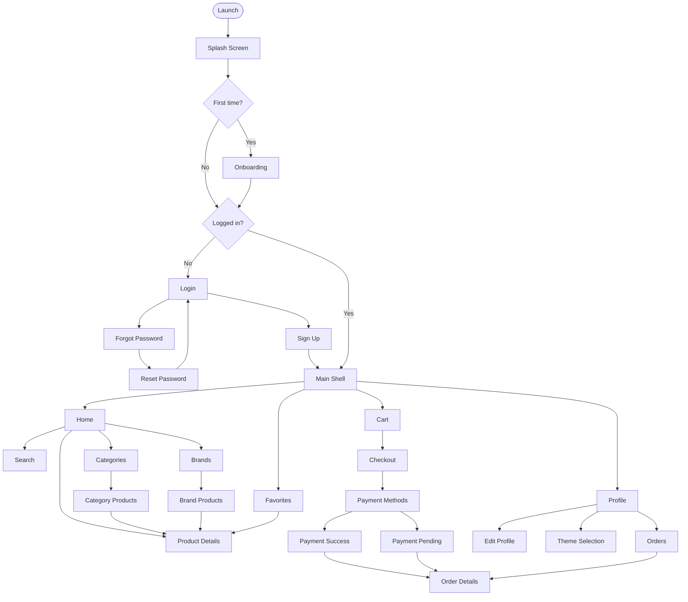

<h1 align="center">🛍️ NextCart — Your Smart Shopping Companion</h1>


<p align="center">
  <a href="https://flutter.dev"></a>
  <a href="https://dart.dev"></a>
  <a href="#"></a>
  <a href="#"></a>
  <a href="https://github.com/Eslam-Hossam1/nextcart/blob/main/LICENSE"></a>
</p>

<p align="center">
  A modern, production-ready Flutter e-commerce app — built with <b>Clean Architecture</b>, <b>Cubit</b>, <b>Supabase</b>, and <b>Stripe</b> payments.
</p>

---

## ✨ Key Features

| Feature | Description |
|:---|:---|
| 🏠 **Home Dashboard** | Beautiful home screen with promo banners, popular products, top brands, and categories |
| 🔍 **Smart Search** | Search for any product instantly with a powerful search engine |
| 📦 **Product Details** | Detailed product view with image carousel, expandable descriptions, and pricing |
| 🏷️ **Categories & Brands** | Browse products by categories or filter by your favorite brands |
| 🛒 **Shopping Cart** | Add, remove, and manage items in your cart seamlessly |
| ❤️ **Favorites / Wishlist** | Save products you love and access them anytime |
| 👤 **User Profile** | View and edit your profile with avatar support |
| 🔐 **Authentication** | Full auth flow — Login, Sign Up, Forgot Password |
| 🌗 **Dark & Light Theme** | Beautifully designed dual theme support with Hydrated Cubit persistence |
| 🎨 **Theme Selection** | Choose your preferred theme from a dedicated settings screen |
| 📱 **Responsive Design** | Adaptive UI using a custom `ResponsiveHelper` for all screen sizes |
| ♻️ **Infinite Scroll / Pagination** | Smooth paginated loading for products, search results, and more |

---

## 📸 App Screenshots

### 🌙 Dark Mode

<table>
<tr>
  <td align="center"></td>
  <td align="center"></td>
  <td align="center"></td>
  <td align="center"></td>
</tr>
<tr>
  <td align="center">Splash Screen</td>
  <td align="center">Onboarding 1</td>
  <td align="center">Onboarding 2</td>
  <td align="center">Onboarding 3</td>
</tr>
<tr>
  <td align="center"></td>
  <td align="center"></td>
  <td align="center"></td>
  <td align="center"></td>
</tr>
<tr>
  <td align="center">Login Screen</td>
  <td align="center">Sign Up Screen</td>
  <td align="center">Home Screen</td>
  <td align="center">Home Screen 2</td>
</tr>
<tr>
  <td align="center"></td>
  <td align="center"></td>
  <td align="center"></td>
  <td align="center"></td>
</tr>
<tr>
  <td align="center">Product Details</td>
  <td align="center">Popular Products</td>
  <td align="center">Categories</td>
  <td align="center">Brands</td>
</tr>
<tr>
  <td align="center"></td>
  <td align="center"></td>
  <td align="center"></td>
  <td align="center"></td>
</tr>
<tr>
  <td align="center">Cart Screen</td>
  <td align="center">Favorites</td>
  <td align="center">Profile Screen</td>
  <td align="center">Edit Profile</td>
</tr>
<tr>
  <td align="center"></td>
  <td align="center"></td>
  <td align="center"></td>
  <td align="center"></td>
</tr>
<tr>
  <td align="center">Fire Sale</td>
  <td align="center">Checkout</td>
  <td align="center">Orders</td>
  <td align="center">Order Details</td>
</tr>
<tr>
  <td align="center"></td>
  <td align="center"></td>
  <td align="center"></td>
  <td align="center"></td>
</tr>
<tr>
  <td align="center">Payment Methods</td>
  <td align="center">Payment Card</td>
  <td align="center">Payment Success</td>
  <td align="center"></td>
</tr>
</table>

---

### ☀️ Light Mode

<table>
<tr>
  <td align="center"></td>
  <td align="center"></td>
  <td align="center"></td>
  <td align="center"></td>
</tr>
<tr>
  <td align="center">Onboarding 1</td>
  <td align="center">Onboarding 2</td>
  <td align="center">Onboarding 3</td>
  <td align="center">Login Screen</td>
</tr>
<tr>
  <td align="center"></td>
  <td align="center"></td>
  <td align="center"></td>
  <td align="center"></td>
</tr>
<tr>
  <td align="center">Sign Up Screen</td>
  <td align="center">Home Screen</td>
  <td align="center">Home Screen 2</td>
  <td align="center">Home Screen 3</td>
</tr>
<tr>
  <td align="center"></td>
  <td align="center"></td>
  <td align="center"></td>
  <td align="center"></td>
</tr>
<tr>
  <td align="center">Product Details</td>
  <td align="center">Popular Products</td>
  <td align="center">Categories</td>
  <td align="center">Brands</td>
</tr>
<tr>
  <td align="center"></td>
  <td align="center"></td>
  <td align="center"></td>
  <td align="center"></td>
</tr>
<tr>
  <td align="center">Cart Screen</td>
  <td align="center">Favorites</td>
  <td align="center">Profile Screen</td>
  <td align="center">Edit Profile</td>
</tr>
<tr>
  <td align="center"></td>
  <td align="center"></td>
  <td align="center"></td>
  <td align="center"></td>
</tr>
<tr>
  <td align="center">Fire Sale</td>
  <td align="center">Checkout</td>
  <td align="center">Orders</td>
  <td align="center">Order Details</td>
</tr>
<tr>
  <td align="center"></td>
  <td align="center"></td>
  <td align="center"></td>
  <td align="center"></td>
</tr>
<tr>
  <td align="center">Payment Methods</td>
  <td align="center">Payment Card</td>
  <td align="center">Payment Success</td>
  <td align="center"></td>
</tr>
</table>

---


## 🧱 Project Structure

```
lib/
│
├── main.dart                    # App entry point
├── app_initializer.dart         # App bootstrap (DI, observers, storage)
├── nextcart_app.dart            # Root MaterialApp with theme & router
│
├── core/
│   ├── config/                  # Supabase & app-level configuration
│   ├── errors/                  # Failure models, API error mapping
│   ├── widgets/                 # Shared reusable widgets
│   ├── theme/                   # App themes, colors, text styles, extensions
│   ├── services/                # Auth credentials, secure storage, Stripe
│   ├── usecases/                # UseCase<Failure, Entity, Params> interfaces
│   ├── routing/                 # GoRouter config, route paths, routing helper
│   ├── di/                      # GetIt service locator setup
│   ├── extensions/              # Dart & Flutter extension helpers
│   ├── helpers/                 # Dialog helpers (AwesomeDialog)
│   ├── models/                  # Shared models
│   ├── entities/                # Global shared entities
│   ├── params/                  # Shared parameter objects
│   ├── cubit/                   # Global cubits (ThemeCubit)
│   ├── Functions/               # Utility / pure functions
│   └── utils/                   # Asset paths, Bloc observer, constants
│
└── features/
    ├── auth/                    # Login & Sign Up
    ├── onboarding/              # First-time onboarding screens
    ├── home/                    # Home dashboard
    ├── banners/                 # Promotional banners
    ├── products/                # Product listing with pagination
    ├── product_details/         # Product detail view with carousel
    ├── categories/              # Categories browser
    ├── category_products/       # Products filtered by category
    ├── brands/                  # Brands browser
    ├── brand_products/          # Products filtered by brand
    ├── search/                  # Real-time product search
    ├── cart/                    # Shopping cart
    ├── favorites/               # Wishlist / Favorites
    ├── checkout/                # Stripe checkout & payment flow
    ├── orders/                  # Order history & order details
    ├── profile/                 # User profile
    ├── edit_profile/            # Edit profile with image picker
    ├── forgot_password/         # Password recovery flow
    ├── theme_selection/         # Theme switching (Dark / Light)
    └── main/                    # Main shell with bottom navigation
```

---

## 🛠️ Tech Stack & Libraries

| Category | Technologies & Libraries |
|:---|:---|
| **Language** | Dart 3.10+ |
| **Framework** | Flutter 3.10+ |
| **Architecture** | Clean Architecture, Repository Pattern |
| **State Management** | flutter_bloc / Cubit |
| **Navigation** | GoRouter (declarative, type-safe routing) |
| **Backend** | Supabase |
| **Dependency Injection** | GetIt (Service Locator) |
| **Error Handling** | Dartz (`Either<Failure, T>`) |
| **Local Storage** | Shared Preferences, Flutter Secure Storage |
| **UI Components** | Google Fonts (Poppins), Flutter SVG, Cached Network Image |
| **Image Handling** | Image Picker, Image Cropper |
| **Dialogs** | Awesome Dialog |
| **Loading States** | Skeletonizer, Modal Progress HUD |
| **Splash** | Flutter Native Splash |
| **Utilities** | Equatable, Path Provider |

---

## 🏗️ Architecture Principles

### ✅ Rules We Follow

| Principle | Description |
|:---|:---|
| **Clean Architecture** | Strict separation into Domain → Data → Presentation layers |
| **Cubit Only** | No Riverpod, no raw Bloc events — Cubit is the single state management solution |
| **Either for Errors** | All error handling uses `Either<Failure, T>` from the `dartz` package |
| **Feature Independence** | No feature depends on another feature; only `core/` is shared |
| **Domain Purity** | Domain layer has zero framework imports — pure Dart only |
| **Params Objects** | No primitive parameters passed to use cases — always wrapped in a `Params` object |
| **Composition over Inheritance** | Small, `const` widgets composed together |
| **Responsive Design** | All sizing handled by `ResponsiveHelper` |
| **Theme Extensions** | Colors & text styles accessed via theme extensions — no inline styling |

### 🔒 Dependency Rules

```
Presentation  ──►  Domain  ◄──  Data
                      ▲
                      │
                    Core (shared everywhere)
```

- **Presentation** depends on **Domain** only
- **Data** depends on **Domain** and **Core**
- **Domain** depends on **nothing** (pure Dart)
- **Core** is accessible from all layers

---

## 🗺️ App Navigation Flow

NextCart uses **GoRouter** for declarative, type-safe navigation with a **StatefulShellRoute** for the main bottom navigation bar.


```mermaid
flowchart TD
    A([Launch]) --> B[Splash Screen]
    B --> C{"First time?"}
    C -- Yes --> D[Onboarding]
    C -- No --> E{"Logged in?"}
    D --> E
    E -- No --> F[Login]
    F --> G[Sign Up]
    F --> H[Forgot Password]
    H --> I[Reset Password]
    I --> F
    J[Main Shell]
    G --> J
    E -- Yes --> J

    J --> K[Home]
    J --> L[Cart]
    J --> M[Favorites]
    J --> N[Profile]

    K --> O[Search]
    K --> P[Product Details]
    K --> Q[Categories]
    K --> R[Brands]

    Q --> S[Category Products]
    R --> T[Brand Products]
    S --> P
    T --> P
    M --> P

    L --> U[Checkout]
    U --> V[Payment Methods]
    V --> W[Payment Success]
    V --> X[Payment Pending]
    W --> Y[Order Details]
    X --> Y

    N --> Z[Edit Profile]
    N --> TS[Theme Selection]
    N --> OR[Orders]
    OR --> Y
```

---

## 👨‍💻 Author

**Eslam Hossam**

<p>
  <a href="https://github.com/Eslam-Hossam1"></a>
</p>

---

<p align="center">
  Made with ❤️ and Flutter 💙
  <br/>
  ⭐ Star this repo if you found it helpful!
</p>
